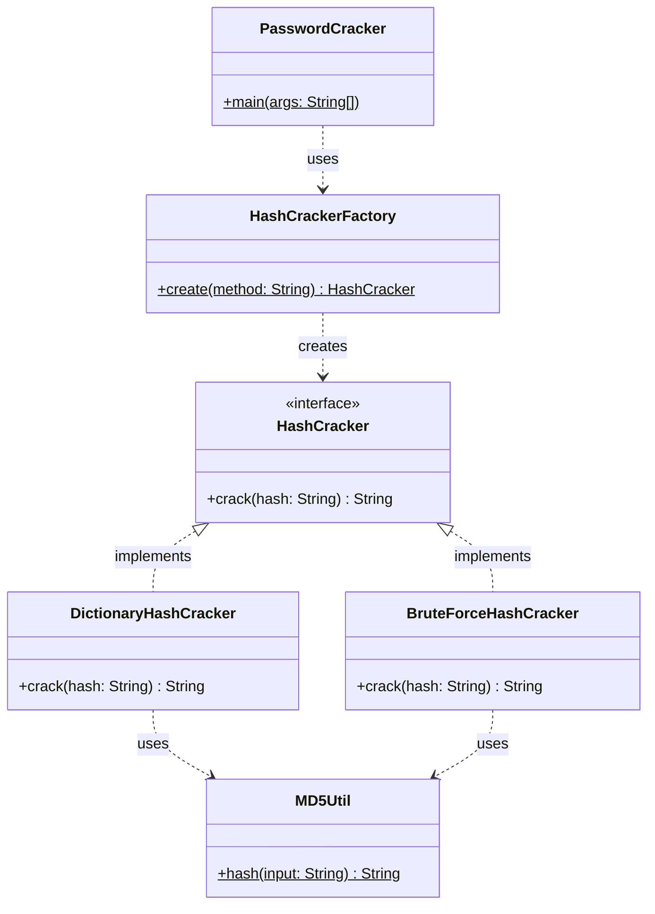

# PasswordCracker — Mini-Projet 1 : Patron de Conception Simple Factory

*Réalisé par Groupe 13*
*Cours de Patrons de Conception — DIC1, École Supérieure Polytechnique (ESP/UCAD), Dakar*

Ce dépôt contient l'implémentation de l'outil `PasswordCracker`, développé dans le cadre du mini-projet 1 du cours de Patrons de Conception. L'outil retrouve un mot de passe en clair à partir de son empreinte MD5, en ligne de commande, en utilisant le patron **Simple Factory**.

---

## 1. Introduction

Dans le domaine de la cybersécurité, les mots de passe ne sont jamais stockés en clair : ils sont sécurisés via des fonctions de hachage cryptographiques comme MD5. L'objectif de ce projet est de développer un outil en ligne de commande (CLI) capable d'auditer la robustesse d'un mot de passe en tentant de retrouver sa forme en clair à partir de son empreinte, tout en respectant une architecture logicielle modulaire et extensible.

## 2. Présentation du problème

Le défi technique consiste à implémenter deux méthodes de cassage distinctes — par dictionnaire et par force brute — sans créer de couplage fort entre le programme principal et les algorithmes de résolution. L'application doit :
- traiter les arguments en ligne de commande (`-m` pour la méthode, `-h` pour le hash) ;
- déléguer entièrement le choix de la stratégie à une fabrique, sans jamais instancier directement (`new`) un algorithme de cassage dans le `main` ;
- rester facilement extensible si une nouvelle stratégie devait être ajoutée plus tard.

## 3. Architecture

Le projet s'articule autour du patron de création **Simple Factory** et se compose de sept fichiers :

| Fichier | Rôle | Tâche |
|---|---|---|
| `HashCracker.java` | Interface commune définissant le contrat `crack(String hash)` | Tâche 1 |
| `HashCrackerFactory.java` | Fabrique Simple — seul endroit du projet où `new` est utilisé pour créer une stratégie | Tâche 1 |
| `DictionaryHashCracker.java` | Stratégie concrète : lecture d'un fichier texte ligne par ligne | Tâche 2 |
| `dictionnaire.txt` | Liste de mots testés par la stratégie dictionnaire | Tâche 2 |
| `BruteForceHashCracker.java` | Stratégie concrète : génération algorithmique de toutes les combinaisons (a → zzzz) | Tâche 3 |
| `MD5Util.java` | Utilitaire partagé de hachage MD5, appelé par les deux stratégies | Tâche 2/3 |
| `PasswordCracker.java` | Point d'entrée CLI : parsing des arguments, appel à la fabrique, chronométrage | Tâche 4 |

**Compilation et exécution :**
```bash
javac *.java
java PasswordCracker -m <BRUTE|DICO> -h <hashMD5>
```

## 4. Diagramme UML




## 5. Usage du patron Simple Factory

L'encapsulation de l'instanciation via `HashCrackerFactory` isole la logique de création des stratégies de leur utilisation. Dans `PasswordCracker.java`, le mot-clé `new` n'apparaît jamais pour une stratégie : le programme demande simplement à la fabrique une instance en lui passant un argument (`DICO` ou `BRUTE`). Le code client ne manipule que l'abstraction `HashCracker`, ce qui favorise le polymorphisme et réduit le couplage.

C'est aussi la seule classe où figure la structure conditionnelle qui évalue la méthode demandée — conformément à l'exigence du sujet de centraliser ce choix en un point unique.

## 6. Résultats obtenus

Tests réalisés directement en ligne de commande sur la machine de développement (Java 17.0.18) :

| Méthode | Hash testé | Résultat | Temps mesuré |
|---|---|---|---|
| DICO | `098f6bcd4621d373cade4e832627b4f6` (mot « test ») | `Password found: test` | ~96 ms |
| BRUTE | `187ef4436122d1cc2f40dc2b92f0eba0` (mot « ab ») | `Password found: ab` | ~70–81 ms |
| BRUTE | `e7247759c1633c0f9f1485f3690294a9` (hash d'exemple du sujet) | `Password not found` | ~1013–1168 ms |
| DICO | `e7247759c1633c0f9f1485f3690294a9` (même hash) | `Password not found` | ~42 ms |
| DICO | `111111111111111111111111111111aa` (hash hors dictionnaire) | `Password not found` | rapide |
| FOO *(méthode invalide)* | `098f6bcd4621d373cade4e832627b4f6` | Erreur gérée proprement, pas de plantage | — |
| *(aucun argument)* | — | Message d'usage affiché | — |

**Note :** le hash d'exemple fourni dans le sujet (`e7247759...`) ne correspond ni à un mot du dictionnaire de test, ni à une combinaison de 4 lettres minuscules maximum — d'où le `Password not found` obtenu avec les deux méthodes. C'est un comportement attendu et non un bug : il illustre justement le second cas de figure prévu par l'énoncé. Les temps varient légèrement d'une exécution à l'autre (quelques dizaines de ms), ce qui est normal et lié au démarrage de la JVM, pas à l'algorithme lui-même.

🎥 **Vidéo de démonstration :** [https://youtu.be/bFt0LZMztbM](https://youtu.be/bFt0LZMztbM)

## 7. Difficultés rencontrées

- **Éviter la duplication de code** : les deux stratégies avaient besoin de générer un hash MD5. Cette logique a été extraite dans une classe utilitaire dédiée (`MD5Util`), appelée par les deux, conformément à l'interdiction de dupliquer du code posée par le sujet.
- **Génération algorithmique de la force brute** : concevoir une génération propre de toutes les combinaisons de 1 à 4 caractères (alphabet minuscule) a demandé de l'attention pour rester efficace sans exploser les temps de calcul.
- **Optimisation des flux pour le dictionnaire** : l'usage d'un `BufferedReader` en `try-with-resources` a permis de lire le fichier ligne par ligne sans charger tout le dictionnaire en mémoire, et de garantir la fermeture automatique du flux.
- **Encodage des accents sous Windows** : la console PowerShell affiche par moments les caractères accentués sous une forme incorrecte (`Méthode` au lieu de `Méthode`). C'est un problème d'encodage propre à la console Windows (qui n'utilise pas UTF-8 par défaut), pas une erreur de logique du programme : la comparaison des hashes MD5 n'est pas affectée, seul l'affichage textuel l'est.
- **Gestion des arguments invalides** : le programme devait rester robuste face à une méthode inconnue (`FOO`) ou à l'absence totale d'arguments, sans jamais planter — géré via une exception explicite et un message d'usage.

## 8. Conclusion

La première version de `PasswordCracker` est pleinement fonctionnelle : elle gère les deux stratégies de cassage demandées, affiche les statistiques d'exécution, et reste robuste face aux erreurs de saisie. L'implémentation stricte du patron Simple Factory a permis d'obtenir un code client épuré, totalement agnostique de l'algorithme de cassage utilisé en arrière-plan. Cette architecture présente néanmoins des limites structurelles, détaillées dans les questions de réflexion ci-dessous, qui justifieront une évolution vers un patron plus flexible dans un prochain mini-projet.

## 9. Questions de réflexion

**1. Quels avantages apporte la fabrique simple ?**
Elle centralise la création des objets en un point unique. Le code client (`PasswordCracker`) est déchargé de la logique d'instanciation, ce qui réduit le couplage entre le programme principal et les classes concrètes. Le code devient plus modulaire, et la gestion des erreurs de création (méthode inconnue) est localisée dans une seule classe.

**2. Quels sont ses inconvénients ?**
La fabrique concentre toute la connaissance des classes concrètes existantes. Plus on ajoute de stratégies, plus sa méthode `create()` grossit (multiplication des `if/else`), ce qui peut la transformer en une classe qui « sait trop de choses ».

**3. Que faut-il modifier lorsqu'une nouvelle stratégie est ajoutée ?**
Le sujet le précise explicitement (page 6, section « Préparation du mini-projet suivant ») : l'ajout d'une nouvelle stratégie nécessite de modifier la classe `HashCrackerFactory` elle-même. Il faut rouvrir le code existant de `create()`, y ajouter une nouvelle condition, puis recompiler la fabrique.

**4. La fabrique respecte-t-elle le principe Open/Closed ?**
Non, et c'est précisément sa limite principale. Le principe Open/Closed exige qu'une entité logicielle soit ouverte à l'extension mais fermée à la modification. Or avec la Simple Factory, chaque nouvelle stratégie oblige à modifier le code interne de la fabrique existante plutôt que de simplement l'étendre — une limitation que le sujet annonce lui-même vouloir corriger dans le mini-projet suivant.
